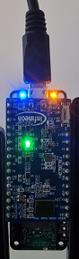

# PSoC&trade; 6 MCU: Gestures Detection with XENSIV&trade; 60-GHz Radar

This code example demonstrates the integration and usage of XENSIV™ Radar Gestures library to detect hand gestures. The library utilizes neural networks and advanced DSP techniques to detect the following gestures. 
- Swipe Up 
- Swipe Down 
- Swipe Left  
- Swipe Right
- Push

Powered by the [XENSIV&trade; 60-GHz radar](https://www.infineon.com/cms/en/product/sensor/radar-sensors/radar-sensors-for-iot/60ghz-radar/bgt60tr13c/), this solution demonstrates highly accurate gesture detection along the line of sight of the radar sensor at distances of 0.2 to 1.0 meters.

[View this README on GitHub.](https://github.com/Infineon/mtb-example-psoc6-radar-gestures)

[Provide feedback on this code example.](https://cypress.co1.qualtrics.com/jfe/form/SV_1NTns53sK2yiljn?Q_EED=eyJVbmlxdWUgRG9jIElkIjoiQ0UyMzgyNTciLCJTcGVjIE51bWJlciI6IjAwMi0zODI1NyIsIkRvYyBUaXRsZSI6IlBTb0MmdHJhZGU7IDYgTUNVOiBHZXN0dXJlcyBEZXRlY3Rpb24gd2l0aCBYRU5TSVYmdHJhZGU7IDYwLUdIeiBSYWRhciIsInJpZCI6InVzbWFubXVoIiwiRG9jIHZlcnNpb24iOiIxLjEuMCIsIkRvYyBMYW5ndWFnZSI6IkVuZ2xpc2giLCJEb2MgRGl2aXNpb24iOiJNQ0QiLCJEb2MgQlUiOiJTQlNZUyIsIkRvYyBGYW1pbHkiOiJQU09DIn0=)


## Requirements

- [ModusToolbox&trade;](https://www.infineon.com/modustoolbox) v3.0 or later (tested with v3.0)
- Board support package (BSP) minimum required version: 4.0.0
- Programming language: C
- Associated parts: All [PSoC&trade; 6 MCU](https://www.infineon.com/cms/en/product/microcontroller/32-bit-psoc-arm-cortex-microcontroller/psoc-6-32-bit-arm-cortex-m4-mcu/) parts


## Supported toolchains (make variable 'TOOLCHAIN')
- GNU Arm&reg; Embedded Compiler v10.3.1 (`GCC_ARM`) – Default value of `TOOLCHAIN`
- Arm&reg; Compiler v6.16 (`ARM`)
- IAR C/C++ Compiler v9.30.1 (`IAR`)


## Supported kits (make variable 'TARGET')

- [Rapid IoT Connect Developer Kit](https://github.com/Infineon/TARGET_CYSBSYSKIT-DEV-01) (`CYSBSYSKIT-DEV-01`) – Default value of `TARGET`
- [Radar Embedded Kit](https://github.com/Infineon/TARGET_KIT-BGT60TR13C-EMBEDD) (`KIT-BGT60TR13C-EMBEDD`)


## Hardware setup

### For Rapid IoT Connect Developer Kit

This code example requires the XENSIV&trade; BGT60TR13C Radar Wing Board as part of the connected sensor kit.

1. Connect the radar wing board to the CYSBSYSKIT-DEV-01 Kit through the pin headers.

2. Connect the CYSBSYSKIT-DEV-01 Kit to the PC with the USB cable.

   **Figure 1. Rapid IoT Connect Developer Kit**

   

   <br>

   **Figure 2. XENSIV&trade; BGT60TR13C Wing Board**

   

3. Mount the CYSBSYSKIT-DEV-01 Kit on a tripod with the USB port towards the top, as shown in **Figure 4**, to ensure optimal performance of the hand gesture detection application.


### For Radar Embedded Kit

1. Connect KIT-BGT60TR13C-EMBEDD to the PC with USB cable.

   **Figure 3. KIT-BGT60TR13C-EMBEDD**

   

2. Mount the  KIT-BGT60TR13C-EMBEDD  on a tripod with the USB port towards the top, as shown in **Figure 7**, to ensure optimal performance of the hand gesture detection application.


## Software setup

Install a terminal emulator if you don't have one. Instructions in this document use [Tera Term](https://ttssh2.osdn.jp/index.html.en).

This example requires no additional software or tools.


## Using the code example

Create the project and open it using one of the following:

<details><summary><b>In Eclipse IDE for ModusToolbox&trade;</b></summary>

1. Click the **New Application** link in the **Quick Panel** (or, use **File** > **New** > **ModusToolbox&trade; Application**). This launches the [Project Creator](https://www.infineon.com/ModusToolboxProjectCreator) tool.

2. Pick the CYSBSYSKIT-DEV-01 Kit supported by the code example from the PSoC&trade; 6 BSPs list shown in the **Project Creator - Choose Board Support Package (BSP)** dialog.

   When you select a supported kit, the example is reconfigured automatically to work with the kit. To work with a different supported kit later, use the [Library Manager](https://www.infineon.com/ModusToolboxLibraryManager) to choose the BSP for the supported kit. You can use the Library Manager to select or update the BSP and firmware libraries used in this application. To access the Library Manager, click the link from the **Quick Panel**.

   You can also just start the application creation process again and select a different kit.

   If you want to use the application for a kit not listed here, you may need to update the source files. If the kit does not have the required resources, the application may not work.

3. In the **Project Creator - Select Application** dialog, choose the **Hand Gesture Detection** application from the *Sensing* group.


4. (Optional) Change the suggested **New Application Name**.

5. The **Application(s) Root Path** defaults to the Eclipse workspace which is usually the desired location for the application. If you want to store the application in a different location, you can change the *Application(s) Root Path* value. Applications that share libraries must be in the same root path.

6. Click **Create** to complete the application creation process.

For more details, see the [Eclipse IDE for ModusToolbox&trade; user guide](https://www.infineon.com/MTBEclipseIDEUserGuide) (locally available at *{ModusToolbox&trade; install directory}/docs_{version}/mt_ide_user_guide.pdf*).

</details>

<details><summary><b>In command-line interface (CLI)</b></summary>

ModusToolbox&trade; provides the Project Creator as both a GUI tool and the command-line tool (*project-creator-cli*). The CLI tool can be used to create applications from a CLI terminal or from within batch files or shell scripts. This tool is available in the *{ModusToolbox&trade; install directory}/tools_{version}/project-creator/* directory.

Use a CLI terminal to invoke the "project-creator-cli" tool. On Windows, use the command-line "modus-shell" program provided in the ModusToolbox&trade; installation instead of a standard Windows command-line application. This shell provides access to all ModusToolbox&trade; tools. You can access it by typing `modus-shell` in the search box in the Windows menu. In Linux and macOS, you can use any terminal application.

The "project-creator-cli" tool has the following arguments:

Argument | Description | Required/optional
---------|-------------|-----------
`--board-id` | Defined in the `<id>` field of the [BSP](https://github.com/Infineon?q=bsp-manifest&type=&language=&sort=) manifest | Required
`--app-id`   | Defined in the `<id>` field of the [CE](https://github.com/Infineon?q=ce-manifest&type=&language=&sort=) manifest | Required
`--target-dir`| Specify the directory in which the application is to be created if you prefer not to use the default current working directory | Optional
`--user-app-name`| Specify the name of the application if you prefer to have a name other than the example's default name | Optional

<br>

The following example clones the "[Hand Gesture Detection](https://github.com/Infineon/mtb-example-psoc6-radar-gesture)" application with the desired name "HandGestureDetection" configured for the *CYSBSYSKIT-DEV-01* BSP into the specified working directory, *C:/mtb_projects*:

   ```
   project-creator-cli --board-id CYSBSYSKIT-DEV-01 --app-id mtb-example-psoc6-radar-gestures --user-app-name HandGestureDetection --target-dir "C:/mtb_projects"
   ```

**Note:** The project-creator-cli tool uses the `git clone` and `make getlibs` commands to fetch the repository and import the required libraries. For details, see the "Project creator tools" section of the [ModusToolbox&trade; user guide](https://www.infineon.com/ModusToolboxUserGuide) (locally available at *{ModusToolbox&trade; install directory}/docs_{version}/mtb_user_guide.pdf*).

</details>

<details><summary><b>In third-party IDEs</b></summary>

Use one of the following options:

- **Use the standalone [Project Creator](https://www.infineon.com/ModusToolboxProjectCreator) tool:**

   1. Launch Project Creator from the Windows Start menu or from *{ModusToolbox&trade; install directory}/tools_{version}/project-creator/project-creator.exe*.

   2. In the initial **Choose Board Support Package** screen, select the BSP and click **Next**.

   3. In the **Select Application** screen, select the appropriate IDE from the **Target IDE** drop-down menu.

   4. Click **Create** and follow the instructions printed in the bottom pane to import or open the exported project in the respective IDE.

<br>

- **Use command-line interface (CLI):**

   1. Follow the instructions from the **In command-line interface (CLI)** section to create the application, and import the libraries using the `make getlibs` command.

   2. Export the application to a supported IDE using the `make <ide>` command.

   3. Follow the instructions displayed in the terminal to create or import the application as an IDE project.

For a list of supported IDEs and more details, see the "Exporting to IDEs" section of the [ModusToolbox&trade; user guide](https://www.infineon.com/ModusToolboxUserGuide) (locally available at *{ModusToolbox&trade; install directory}/docs_{version}/mtb_user_guide.pdf*).

</details>

**Note:** To use this code example in ModusToolbox&trade; v2.4, see [XENSIV&trade; KIT_CSK_BGT60TR13C user guide](https://www.infineon.com/cms/en/product/evaluation-boards/kit_csk_bgt60tr13c/#!documents).


## Operation

1. Mount the radar wing board on the CYSBSYSKIT-DEV-01 Kit and connect the board to your PC using the provided USB cable through the KitProg3 USB connector. For proper detection, mount the sensor on a tripod with the USB port towards the top, as shown in **Figure 4**.

      **Figure 4. CYSBSYSKIT-DEV-01 Kit orientation for proper detection**

      

2. Open a terminal program and select the [KitProg3](https://www.infineon.com/dgdl/Infineon-KitProg3_User_Guide-UserManual-v01_00-EN.pdf?fileId=8ac78c8c7d0d8da4017d0f01221f1853) COM port. Set the serial port parameters to 8N1 and 115200 baud.

3. Program the board using one of the following:

   <details><summary><b>Using Eclipse IDE for ModusToolbox&trade;</b></summary>

      1. Select the application project in the Project Explorer.

      2. In the **Quick Panel**, scroll down, and click **\<Application Name> Program (KitProg3_MiniProg4)**.

   </details>

   <details><summary><b>Using CLI</b></summary>

     From the terminal, execute the `make program` command to build and program the application using the default toolchain to the default target. The default toolchain and target are specified in the application's Makefile, but you can override those values manually:
      ```
      make program TARGET=<BSP> TOOLCHAIN=<toolchain>
      ```

      Example:
      ```
      make program TARGET=CYSBSYSKIT-DEV-01 TOOLCHAIN=GCC_ARM
      ```
   </details>


4. *(Only for KIT-BGT60TR13C-EMBEDD)* KIT-BGT60TR13C-EMBEDD requires an external programmer such as MiniProg4 that uses the SWD interface. Set the proper jumpers on switches S3 and S5.

   1. Switch S3: Close pins 1 and 2, and open pins 3 and 4.

      **Figure 5. Switch 3 position**

      

   2. Switch S5: Close pins 1 and 2, and open pins 3 and 4.

      **Figure 6. Switch 5 position**

      

   3. Connect the KIT-BGT60TR13C-EMBEDD SWD interface with the programmer. Then, plug-in the USB cables for the board and for the programmer to power ON both of them.

   4. For proper detection, mount the sensor on a tripod with the USB port towards the top, as shown in **Figure 7**.
   
      **Figure 7. KIT-BGT60TR13C-EMBEDD orientation for proper detection**

      

   5. Open a terminal program and select a COM port where the board is connected (not the MiniProg4 port). Set the serial port parameters to 8N1 and 115200 baud.

   6. Program the board using one of the following:

      <details><summary><b>Using Eclipse IDE for ModusToolbox&trade;</b></summary>

      1. Select the application project in the Project Explorer.

      2. In the **Quick Panel**, scroll down and click **\<Application Name> Program (KitProg3_MiniProg4)**.
      </details>

      <details><summary><b>Using CLI</b></summary>

       From the terminal, execute:

       ```
       make program TARGET=KIT-BGT60TR13C-EMBEDD TOOLCHAIN=GCC_ARM
       ```
       </details>


5. After successful programming, the UART terminal will display the message "Gesture detection using XENSIV&trade; 60-GHz radar". Once you start performing different gestures, the corresponding message equivalent to the detected gesture will be printed, as shown in **Figure 8**. 

   **Figure 8. Terminal output with recognized hand gestures**

   

   <br>

   The table below explains what is printed on the terminal.

   **Table 1. Terminal outputs**

   | Parameters  | Example  | Description  |
   | ----------- | ----------- | -----    |
   | class  | `SWIPE_UP` | Type of detected hand gesture.
   | score | `0.999999` | Confidence in the detected gesture. (1: most confident, 0: least confident)

   The supported gestures are as follows:

   | **Figure 9. Push gesture** | **Figure 10. Swipe Left gesture** | **Figure 11. Swipe Right gesture** | **Figure 12. Swipe Up gesture** | **Figure 13. Swipe Down gesture** |
   | -------------------------- | --------------------------------- | ---------------------------------- | ------------------------------- | ----------------------- |
   |  |  |  |  |  |

### Sensor information and LEDs

   | **Figure 14. CYSBSYSKIT-DEV-01 LEDs** | **Figure 15. KIT-BGT60TR13C-EMBEDD LEDs** |
   | ------------------------------------- | ----------------------------------------- |
   |       |  |

1. For CYSBSYSKIT-DEV-01, the radar task is suspended if the radar wing board is not connected to the feather kit. The sensor initialization process is indicated by blinking the Red LED (CYBSP_USER_LED). The Red LED (CYBSP_USER_LED) on CYSBSYSKIT-DEV-01 keeps blinking at approximately 1 Hz when the system is operational (ready state).

   Note that there is no user LED (CYBSP_USER_LED) for the KIT-BGT60TR13C-EMBEDD board.

2. The RGB LED indicates different events with different colors, as follows:

   **Table 2. Events and LED indication**

   | LED color  | Event type  | Description  |
   | ----------- | ----------- | -----    |
   | Red   |  Gesture event detected | Red LED is turned ON for a second upon successful detection of a gesture.
   | Green |  No gesture detected | Green LED is turned ON by default, indicating the sensor is ready to perform gesture detection.
   | Blue  |  Settings Mode | Blue LED is turned ON while the sensor is in Settings Mode.


### Configuration parameters

You can configure the application parameters using the options provided on the terminal as follows:

1. Press the **Enter** key to switch from 'work' to 'settings', i.e., configuration mode.

2. Type `help` and press the **Enter** key to see a list of configurable parameters, as shown in **Figure 16**.

   **Figure 16. Configuration mode**

   

   The supported configuration commands are as follows:

   **Table 3. Supported Configuration Commands**

   | Command | Input Parameter | Description | Example |
   | ------- | --------------- | ----------- | ------- |
   | help    | Nil             | Request for list of supported commands | `help`
   | verbose | <enable/disable> | Enable/disable detailed verbose status to be updated every second | `verbose enable`
   | board_info | Nil | Request for Board Information (for example, application name, application version, board name, board version, and so on.) | `board_info`
   | config | Nil | Request for Solution Config (for example, supported gestures, currently-enabled gestures, and so on.) | `config`
   | gestures_list | Nil | Request for gestures supported by the solution | `gestures_list`
   | gestures_detect | <PUSH/SWIPE_LEFT/SWIPE_RIGHT/SWIPE_UP/SWIPE_DOWN/ALL> | Enable detection of specific gestures from the supported list (multiple input parameters allowed). This is done at application/code example level in order to provide flexibility to user | `gestures_detect PUSH SWIPE_LEFT SWIPE RIGHT` or `gestures_detect ALL`


3. Command response on failure

   On failure, i.e., bad syntax or bad formation of a command with acceptable value input, either "command not recognized" or "invalid value" is printed on the console.

   For details, see the [XENSIV&trade; Radar Gesture API Reference Guide](https://infineon.github.io/xensiv-radar-gesture/html/index.html).

4. Press **Esc** key to exit from 'Settings' mode.


## Infineon XENSIV&trade; Config Tool

The [XENSIV&trade; Config Tool](https://infineon.github.io/xensiv-config-tool) is a web-based tool that enables offline evaluation of applications without having to go into an embedded development environment. Using this tool, you can visualize the gesture that was detected, select a particular supported gesture, flash the device with a pre-compiled code example binary, or retrieve the code example directly from GitHub for further development.


## Debugging

You can debug the example to step through the code. In the IDE, use the **\<Application Name> Debug (KitProg3_MiniProg4)** configuration in the **Quick Panel**. For details, see the "Program and debug" section in the [Eclipse IDE for ModusToolbox&trade; user guide](https://www.infineon.com/MTBEclipseIDEUserGuide).


**Note:** **(Only while debugging)** On the CM4 CPU, some code in `main()` may execute before the debugger halts at the beginning of `main()`. This means that some code executes twice: once before the debugger stops execution and again after the debugger resets the program counter to the beginning of `main()`. See [KBA231071](https://community.infineon.com/docs/DOC-21143) to learn about this and for the workaround.


## Design and implementation

### Resources and settings

This application uses a modular approach to build a gesture application, combining a radar driver and gesture algorithm library with the following components:

**Figure 17. Application overview**


The radar configuration parameters are generated from a PC and saved in *radar_settings.h*. For more details, see the [XENSIV&trade; BGT60TRxx Radar API Reference Guide](https://infineon.github.io/sensor-xensiv-bgt60trxx/html/index.html).

After initialization, the application runs in an event-driven way. The radar interrupt is used to notify the MCU, which retrieves the raw data into a software buffer and then triggers the main task to normalize and feed the data to the gesture library.

**Figure 18. Application execution**


## Gesture API

**Table 4. API functions**

API function | Description
-------------|------------
`gestures_init` | Initializes XENSIV&trade; Radar Gestures recognition algorithmic kernel.
`gestures_run` | Run gesture recognition algorithmic kernel.
`gestures_deinit` | De-initializes XENSIV&trade; Radar Gestures recognition algorithmic kernel.
`get_logits` | Retrieve all detection indices.


**Table 5. Application resources**

 Resource  |  Alias/object     |    Purpose
 :-------- | :-------------    | :------------
 UART (HAL)|cy_retarget_io_uart_obj| UART HAL object used by Retarget-IO for the Debug UART port.
 SPI (HAL)    | spi     | SPI driver to communicate with radar sensor.
 GPIO (HAL)    | CYBSP_USER_LED     | Indicates that the program is working properly.
 GPIO (HAL)    | LED_RGB_RED     | Indicates that a new gesture has been recognized.
 GPIO (HAL)    | LED_RGB_GREEN    | Indicates that there is no gesture recognized.
 GPIO (HAL)    | LED_RGB_BLUE    | Indicates that the device is in Settings Mode.

<br>


## Related resources

Resources  | Links
-----------|----------------------------------
Application notes  | [AN228571](https://www.infineon.com/AN228571) – Getting started with PSoC&trade; 6 MCU on ModusToolbox&trade; <br>  [AN215656](https://www.infineon.com/AN215656) – PSoC&trade; 6 MCU: Dual-CPU system design <br>
Code examples  | [Using ModusToolbox&trade;](https://github.com/Infineon/Code-Examples-for-ModusToolbox-Software) on GitHub <br>
Device documentation | [PSoC&trade; 6 MCU datasheets](https://www.infineon.com/cms/en/product/microcontroller/32-bit-psoc-arm-cortex-microcontroller/psoc-6-32-bit-arm-cortex-m4-mcu/#!documents) <br> [PSoC&trade; 6 technical reference manuals](https://www.infineon.com/cms/en/product/microcontroller/32-bit-psoc-arm-cortex-microcontroller/psoc-6-32-bit-arm-cortex-m4-mcu/#!documents)<br>
Development kits | [XENSIV&trade; KIT CSK BGT60TR13C](https://www.infineon.com/cms/en/product/evaluation-boards/kit_csk_bgt60tr13c/) <br> [Radar Embedded Kit](https://github.com/Infineon/TARGET_KIT-BGT60TR13C-EMBEDD)
Libraries on GitHub  | [sensor-xensiv-bgt60trxx](https://github.com/Infineon/sensor-xensiv-bgt60trxx) –  Driver library to interface with the XENSIV&trade; BGT60TRxx 60 GHz FMCW radar sensors <br> [xensiv-radar-gesture](https://github.com/Infineon/xensiv-radar-gesture) – Gesture library to detect hand gestures using XENSIV&trade; BGT60TR13C <br> [sensor-dsp](https://github.com/Infineon/sensor-dsp) – Sensor-DSP library to provide signal processing functions for sensor applications <br> [mtb-pdl-cat1](https://github.com/Infineon/mtb-pdl-cat1) – PSoC&trade; 6 peripheral driver library (PDL)  <br> [mtb-hal-cat1](https://github.com/Infineon/mtb-hal-cat1) – Hardware abstraction layer (HAL) library <br> [retarget-io](https://github.com/Infineon/retarget-io) – Utility library to retarget STDIO messages to a UART port <br>
Middleware on GitHub  |  [psoc6-middleware](https://github.com/Infineon/modustoolbox-software#psoc-6-middleware-libraries) – Links to all PSoC&trade; 6 MCU middleware
Tools  | [Eclipse IDE for ModusToolbox&trade;](https://www.infineon.com/modustoolbox) – ModusToolbox&trade; is a collection of easy-to-use software and tools enabling rapid development with Infineon MCUs, covering applications from embedded sense and control to wireless and cloud-connected systems using AIROC&trade; Wi-Fi and Bluetooth&reg; connectivity devices.

<br>


## Other resources

Infineon provides a wealth of data at www.infineon.com to help you select the right device, and quickly and effectively integrate it into your design.

For PSoC&trade; 6 MCU devices, see [How to design with PSoC&trade; 6 MCU – KBA223067](https://community.infineon.com/docs/DOC-14644) in the Infineon Developer community.

For more information about Connected Sensor Kit, see [IoT Sensors Platform](https://www.infineon.com/connectedsensorkit).


## Document history

Document title: *CE238257* – *PSoC&trade; 6 MCU : Gestures Detection with XENSIV&trade; 60-GHz Radar*

 Version | Description of change
 ------- | ---------------------
 0.5.0   | New code example
 1.0.0   | Updated to ModusToolbox version 3.5
 1.1.0   | Updated ModusToolbox ignore paramters
<br>


---------------------------------------------------------

© Cypress Semiconductor Corporation, 2023. This document is the property of Cypress Semiconductor Corporation, an Infineon Technologies company, and its affiliates ("Cypress").  This document, including any software or firmware included or referenced in this document ("Software"), is owned by Cypress under the intellectual property laws and treaties of the United States and other countries worldwide.  Cypress reserves all rights under such laws and treaties and does not, except as specifically stated in this paragraph, grant any license under its patents, copyrights, trademarks, or other intellectual property rights.  If the Software is not accompanied by a license agreement and you do not otherwise have a written agreement with Cypress governing the use of the Software, then Cypress hereby grants you a personal, non-exclusive, nontransferable license (without the right to sublicense) (1) under its copyright rights in the Software (a) for Software provided in source code form, to modify and reproduce the Software solely for use with Cypress hardware products, only internally within your organization, and (b) to distribute the Software in binary code form externally to end users (either directly or indirectly through resellers and distributors), solely for use on Cypress hardware product units, and (2) under those claims of Cypress’s patents that are infringed by the Software (as provided by Cypress, unmodified) to make, use, distribute, and import the Software solely for use with Cypress hardware products.  Any other use, reproduction, modification, translation, or compilation of the Software is prohibited.
<br>
TO THE EXTENT PERMITTED BY APPLICABLE LAW, CYPRESS MAKES NO WARRANTY OF ANY KIND, EXPRESS OR IMPLIED, WITH REGARD TO THIS DOCUMENT OR ANY SOFTWARE OR ACCOMPANYING HARDWARE, INCLUDING, BUT NOT LIMITED TO, THE IMPLIED WARRANTIES OF MERCHANTABILITY AND FITNESS FOR A PARTICULAR PURPOSE.  No computing device can be absolutely secure.  Therefore, despite security measures implemented in Cypress hardware or software products, Cypress shall have no liability arising out of any security breach, such as unauthorized access to or use of a Cypress product. CYPRESS DOES NOT REPRESENT, WARRANT, OR GUARANTEE THAT CYPRESS PRODUCTS, OR SYSTEMS CREATED USING CYPRESS PRODUCTS, WILL BE FREE FROM CORRUPTION, ATTACK, VIRUSES, INTERFERENCE, HACKING, DATA LOSS OR THEFT, OR OTHER SECURITY INTRUSION (collectively, "Security Breach").  Cypress disclaims any liability relating to any Security Breach, and you shall and hereby do release Cypress from any claim, damage, or other liability arising from any Security Breach.  In addition, the products described in these materials may contain design defects or errors known as errata which may cause the product to deviate from published specifications. To the extent permitted by applicable law, Cypress reserves the right to make changes to this document without further notice. Cypress does not assume any liability arising out of the application or use of any product or circuit described in this document. Any information provided in this document, including any sample design information or programming code, is provided only for reference purposes.  It is the responsibility of the user of this document to properly design, program, and test the functionality and safety of any application made of this information and any resulting product.  "High-Risk Device" means any device or system whose failure could cause personal injury, death, or property damage.  Examples of High-Risk Devices are weapons, nuclear installations, surgical implants, and other medical devices.  "Critical Component" means any component of a High-Risk Device whose failure to perform can be reasonably expected to cause, directly or indirectly, the failure of the High-Risk Device, or to affect its safety or effectiveness.  Cypress is not liable, in whole or in part, and you shall and hereby do release Cypress from any claim, damage, or other liability arising from any use of a Cypress product as a Critical Component in a High-Risk Device. You shall indemnify and hold Cypress, including its affiliates, and its directors, officers, employees, agents, distributors, and assigns harmless from and against all claims, costs, damages, and expenses, arising out of any claim, including claims for product liability, personal injury or death, or property damage arising from any use of a Cypress product as a Critical Component in a High-Risk Device. Cypress products are not intended or authorized for use as a Critical Component in any High-Risk Device except to the limited extent that (i) Cypress’s published data sheet for the product explicitly states Cypress has qualified the product for use in a specific High-Risk Device, or (ii) Cypress has given you advance written authorization to use the product as a Critical Component in the specific High-Risk Device and you have signed a separate indemnification agreement.
<br>
Cypress, the Cypress logo, and combinations thereof, WICED, ModusToolbox, PSoC, CapSense, EZ-USB, F-RAM, and Traveo are trademarks or registered trademarks of Cypress or a subsidiary of Cypress in the United States or in other countries. For a more complete list of Cypress trademarks, visit www.infineon.com. Other names and brands may be claimed as property of their respective owners.
